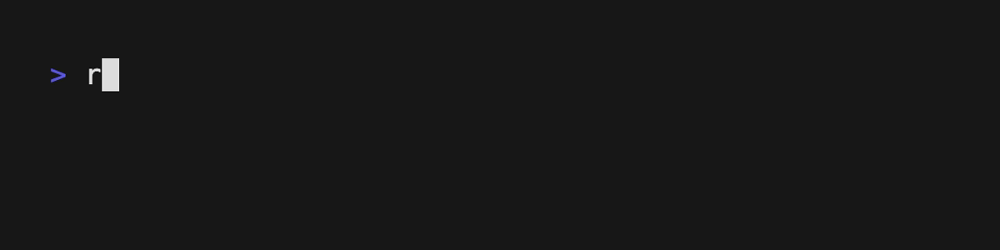
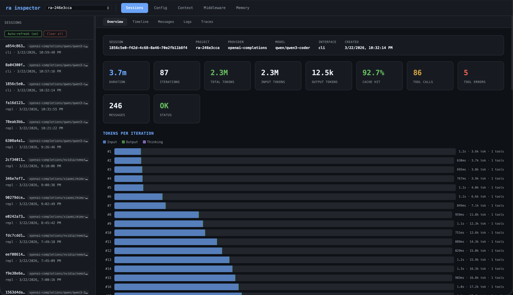

<h1 align="center">ra</h1>

<p align="center"><strong>Your agent, your rules.</strong></p>

<p align="center">
  <a href="https://github.com/chinmaymk/ra/blob/main/LICENSE"></a>
  <a href="https://github.com/chinmaymk/ra/actions"></a>
  <a href="https://github.com/chinmaymk/ra/releases"></a>
</p>

<p align="center">
  <a href="#install">Install</a> &middot;
  <a href="#the-loop">The Loop</a> &middot;
  <a href="#middleware">Middleware</a> &middot;
  <a href="#tools">Tools</a> &middot;
  <a href="#recipes">Recipes</a> &middot;
  <a href="#docs">Docs</a>
</p>

<p align="center">
  
</p>

---

Most agent frameworks lock you in. ra doesn't — every decision the agent makes flows through hooks you control, tools you define, and configs you commit. No hidden prompts, no black-box loops, no vendor lock-in.

One config file is the difference between a coding agent, a code reviewer, a research loop, and a multi-agent orchestrator:

```bash
ra "Fix the failing tests and open a PR"
ra --config recipes/code-review-agent  "Review the last 3 PRs"
ra --config recipes/karpathy-autoresearch "Survey recent advances in KV-cache compression"
ra --config recipes/multi-agent "Refactor the auth module, test it, and update the docs"
```

## Install

```bash
curl -fsSL https://raw.githubusercontent.com/chinmaymk/ra/main/install.sh | bash
```

Works with Anthropic, OpenAI, Google, Ollama, Bedrock, Azure, OpenRouter, and LiteLLM — switch with `--provider`. [All providers →](https://chinmaymk.github.io/ra/providers/)

## The Loop

No arbitrary iteration caps — the agent runs until the job is done. You set the budget, ra enforces it:

```yaml
agent:
  maxTokenBudget: 500_000   # hard cap on total token spend
  maxDuration: 600_000      # max wall-clock time in ms
  thinking: adaptive        # scales reasoning effort automatically
```

Token budgets and duration limits trigger a clean shutdown, not a crash. Adaptive thinking starts high for planning and tapers off during execution — so you're not burning tokens on boilerplate. Context compaction kicks in automatically near the window limit — no dropped conversations, no silent truncation.

## Middleware

Intercept any step in the loop — read the full context, mutate it, or stop it entirely.

```ts
// middleware/audit.ts — log every tool call
export default async (ctx) => {
  const { name, arguments: args } = ctx.toolCall
  ctx.logger.info('tool', { name, args })
}
```

Wire them to hooks in config:

```yaml
agent:
  middleware:
    afterToolExecution:
      - ./middleware/audit.ts
```

**Available hooks:** `beforeLoopBegin`, `beforeModelCall`, `onStreamChunk`, `afterModelResponse`, `beforeToolExecution`, `afterToolExecution`, `afterLoopIteration`, `afterLoopComplete`, `onError`.

## Tools

**Built-in:** `Read`, `Write`, `Edit`, `Bash`, `Glob`, `Grep`, `WebFetch`, `Agent` (parallel sub-agents), and more — enable, disable, or configure each one independently. Permissions use a simple regex allow/deny system — no custom DSL, just patterns you already know:

```yaml
permissions:
  rules:
    - tool: Bash
      command:
        allow: ["^git ", "^bun "]
        deny: ["--force", "--no-verify"]
    - tool: Write
      path:
        deny: ["\\.env", "secrets"]
```

**Custom tools** — export a function, register it in config, and the model picks it up. Works with TypeScript, shell scripts, and any scripting language — [see the docs](https://chinmaymk.github.io/ra/tools/custom).

## Recipes

Each recipe is a complete agent — config, middleware, tools, and skills — committed to your repo with the same observability and control as everything else.

| Recipe | What it does | Model | Key difference |
|--------|-------------|-------|----------------|
| **[Coding Agent](recipes/coding-agent/)** | Edits files, runs tests, ships code | Opus | Memory, high thinking, read-before-write discipline |
| **[Code Review Agent](recipes/code-review-agent/)** | Reviews PRs against your style guide | Sonnet | Token budget middleware, severity tiers |
| **[Auto-Research](recipes/karpathy-autoresearch/)** | Runs experiments, evaluates, iterates | Sonnet | 500 iterations, 15-min tool timeouts |
| **[Multi-Agent](recipes/multi-agent/)** | Spawns and coordinates specialist agents | Sonnet | Concurrency 4, orchestrator skill |
| **[oh-my-ra](recipes/oh-my-ra/)** | Batteries-included: coding + research + debugging + delivery | Sonnet | 16 skills, 8 middleware, 2 custom tools |
| **[Auto-Improve](recipes/auto-improve/)** | Hyperparameter and prompt optimization | Sonnet | Parallel axis exploration, checkpoint recovery |
| **[ra-claude-code](recipes/ra-claude-code/)** | Coding agent inspired by Claude Code | Opus | 10 on-demand skills, session memory |

```bash
ra --config recipes/oh-my-ra "Refactor the auth module and write tests"
```

## Configuration

Config lives in your repo — no hidden prompts, no default system prompt. One engineer defines the agent, commits it, everyone runs the exact same thing.

```yaml
# ra.config.yml
agent:
  provider: anthropic
  model: claude-sonnet-4-6
  thinking: adaptive
  maxTokenBudget: 500_000
  skillDirs: [./skills]
  middleware:
    - ./middleware/token-budget.ts
    - ./middleware/audit-log.ts
  memory:
    enabled: true
```

Layered overrides: `defaults → config file → env vars → CLI flags`. YAML, JSON, or TOML.

## Run Anywhere

ra isn't just a CLI. Pick the interface that fits your workflow:

| Mode | Command | Use case |
|------|---------|----------|
| **REPL** | `ra` | Interactive multi-turn with history, slash commands, file attachments |
| **CLI** | `ra "prompt"` | One-shot prompts, piping, scripting |
| **HTTP** | `ra --http` | Streaming chat API with session management |
| **MCP** | `ra --mcp-stdio` | Expose as a tool for Cursor, Claude Desktop, or other agents |
| **Cron** | `ra --interface cron` | Scheduled autonomous jobs with isolated logs |
| **Inspector** | `ra --inspector` | Web dashboard — iterations, tokens, tool calls, traces |

## Observability

Every model call, tool execution, and decision is captured automatically — structured JSONL logs, trace spans, and a built-in web inspector that shows the full picture: iterations, token spend, tool calls, and the complete message history.

```bash
ra --inspector
```

<p align="center">
  
</p>

## Docs

Full reference at [chinmaymk.github.io/ra](https://chinmaymk.github.io/ra/) — tools, skills, middleware, providers, configuration, and deployment guides.

## License

MIT

---

<p align="center">
  <b>ra</b> — Your agent, your rules.
</p>
